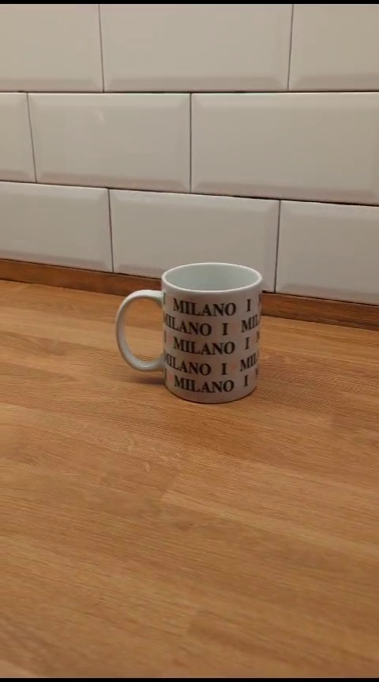
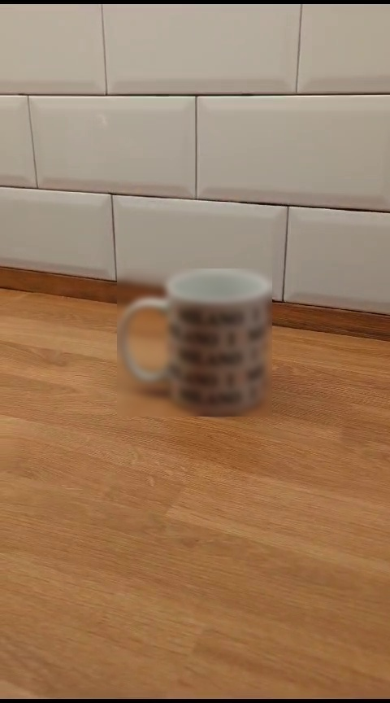

# YOLO Video Blur

Welcome to the YOLO Video Blur repository! 

This is a basic example about how to use Yolov8 from ultralytics package. 
In this example, Yolov8 is used to detect a specific type of object and blur that area of the image.

I strongly recommend to consult the original repository, it is full of information and examples about how to use it:

https://github.com/ultralytics/ultralytics

But just in case, here is one more example!

## How to use YOLO
Since Yolov8, Ultralytics has greatly facilitated our work for using it. It is as simple as importing Ultralytics module, defining the selected model, providing the image to the model, and... voilá (inference)! We have our image analyzed.

* In the __"defining the selected model" step__ we can choose between using one of the pretained models or using one of our custom models. In this example, we will use Yolov8n, that is one of the legacy pretained models and that is already in the working directory. If it were not, the model would be automatically downloaded.

* In the __"voilá (inference)" step__, we will use one of the simplest options, just specifying the classes to be detected and that the model must run the process on the cpu, but there are many other options that can be configured.

Here is a snippet of code about how to perform a basic detection:
```python
import ultralytics
model = YOLO("yolov8n.pt")
results = model(source="input_image_path.jpg", device='cpu')
```
(If we don't specify a class to be detected, all the classes of the model are considered).

About how to interpret the results, you can take a look about how is done in the _main.py_ file of this repository but, again, I strongly recommend to consult the official Ultralytics documentation.

## How to use this example
__Good news! (🎉)__
The code provided in this repository is completely ready for execution. The only thing you need to do is to run the _main.py_, for example, from your CLI with:
```
python3 main.py
```
__Bad news! (😰)__
For running this code, docker is used, so you may have a minimal knowledge about how to use docker.
 (Unless you don't mind installing and running Ultralytics module on your host).

That's why there is not a _requirements.txt_ file in this project. Everything we need is already inside the docker image: _"ultralytics/ultralytics:latest-cpu"_. So, for running this code, the only thing we have to do is to run the _main.py_ file, but inside an environment with ultralytics as, for example, the _"ultralytics/ultralytics:latest-cpu"_ image. 


<div style="text-align:center">
    
</div>

Other options are installing Ultralytics module in your local host environment, installing it using a virtual environment, or follow any of the options that are explained in Ultralytics official documentation.

## Code snippet for using this example with Docker
Here is a generic (that you can use and modify) code snippet you can run if you are not familiar with Docker. Anyway, you previously need to have Docker installed.
This code launches a docker container with _"ultralytics/ultralytics:latest-cpu"_ image and binds a shared volume with the code of this repository inside the container:
```
docker run -it \
  --name yolo-blur \
  --network host \
  -v "$(pwd)":/home/yolo-blurr \
  ultralytics/ultralytics:latest-cpu \
  /bin/bash -c "cd /home/yolo-blurr/code && bash"
```
Just write that code inside a ".sh" file in the working directory of the repository, for example "run.sh", and execute it on your CLI:
```
./run.sh
```
The script will run a container named "yolo-blur" and will automatically land you into a CLI inside the running container. Once there, you are ready to execute the "main.py" code.

## Results
You can use the _"/data/input_video.mp4"_ that is already provided to test this repository, the results obtained should be saved in _"/data/output_video.mp4"_ file.

There is a _"debug"_ parameter that can be set to True to obtain the frames of each step of the process.

Here are is a video frame before, and after processing:
<div style="text-align:center">
    
    
</div>

Now your are totally ready to use this repository. Feel free to ask about anything that is not clear or any bug you find in the code.

Happy coding using it! :rocket:


